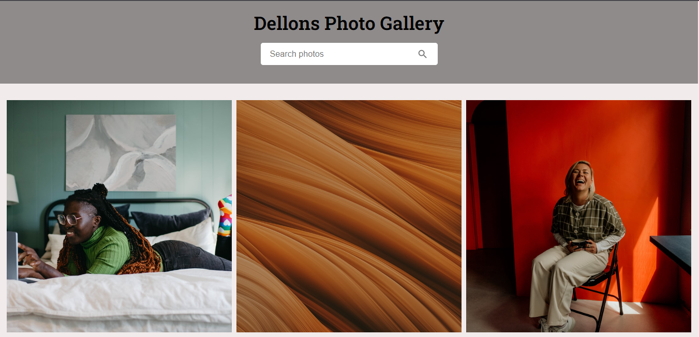
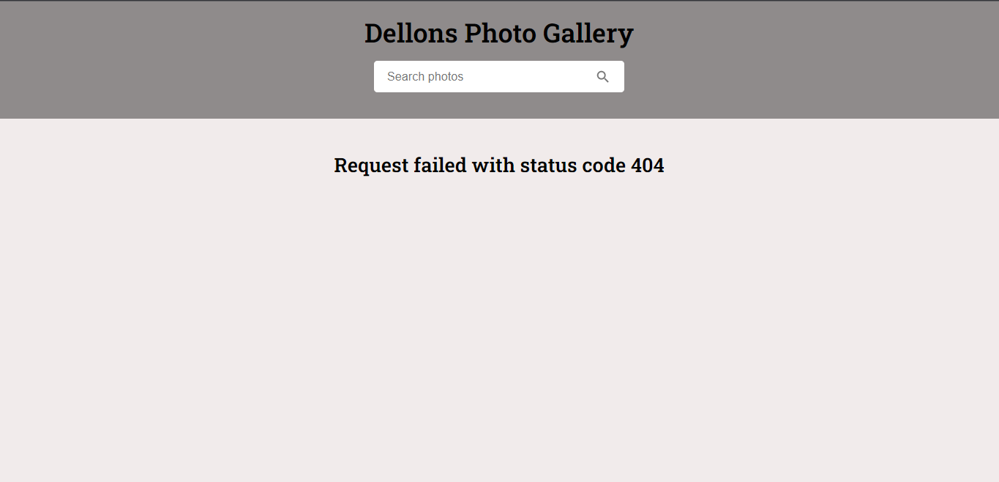

# Dellons Photo Gallery
### Description
This Website is a photo gallery website that displays pictures sourced from the unsplash API and displays it on the page. It also allows you to search an image of any category and the website displays it for you.
It is was developed with React, HTML and CSS.

Dellons photo gallery is also user friendly and interactive so you won't have a hard time using. It will be upgraded with time and users feedback will go a long way in helping the developer.

### Code section

```javascript
import './App.css';
import {useState, useEffect } from 'react';
import SearchIcon from "@mui/icons-material/Search";
import useFetch from './useFetch';

function App() {
  const axiosCall = useFetch;
  const accessKey = process.env.REACT_APP_ACCESS_KEY;
  const url = `https://api.unsplash.com/photos/?client_id=${accessKey}`;
  const [images, setImages] = useState([]);
  const [error, setError] = useState('');

  const [searchPhotos, setSearchPhotos] = useState("");
  const [results, setResults] = useState([]);
  const searchURL = `https://api.unsplash.com/search/photos?page=1&query=${searchPhotos}&client_id=${accessKey}`;

  useEffect(() => {
    axiosCall(url)
    .then(res => {
      setImages(res.data);
    }).catch(err => {
      setError(err);
    })
  }, [axiosCall, url]);

  const handleChange = (e) => {
    
    if (e.key === "Enter") {
      axiosCall(searchURL).then((res) => {
        setResults(res.data.results);
        setImages(results);
        handleChange('');
      }).catch(err => {
        setError(err);
      })
    }
  };

  return (
    <div className="App">
      <div className="top">
        <h1>Dellons Photo Gallery</h1>
        <div className="search-bar">
          <input
            type="text"
            onChange={(e) => setSearchPhotos(e.target.value)}
            placeholder="Search photos"
            onKeyPress={handleChange}
          />
          <SearchIcon className="search-icon" />
        </div>
      </div>
      <div className="images">
        {results.map((result) => (
          
        ))}
      </div>

      <div className="images">
        {images.map((image) => (
          
        ))}
      </div>
      <div className="error">{error.message}</div>
    </div>
  );
}

export default App;
```
### The User Interface


When the website launches, it loads images from different categories and displays it for our view. 
The search field located at the top middle corner of the screen allows you to search any image of your choice and it gets displayed on the screen.

### Error 


When a user sends a bad request or when there is a bad network connection, a 404 error will be displayed on the screen showing that the request failed.

### Useful Links
...[React website](https://reactjs.org/)
...[unsplash website](https://unsplash.com/)